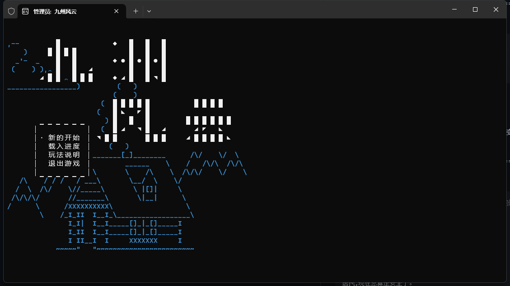
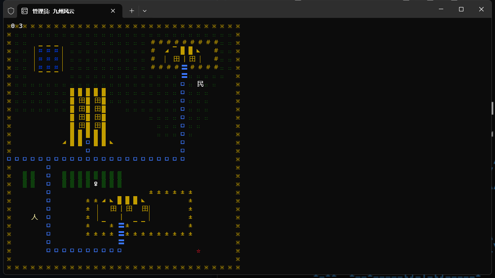
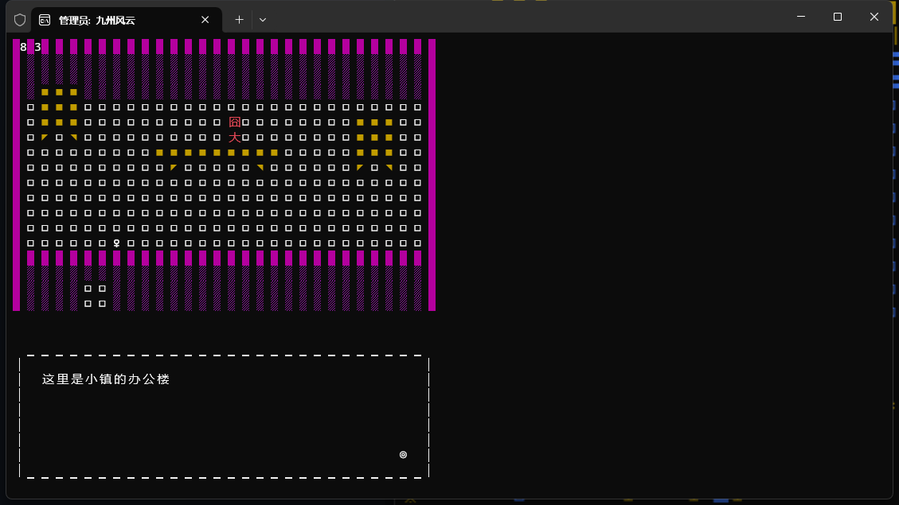
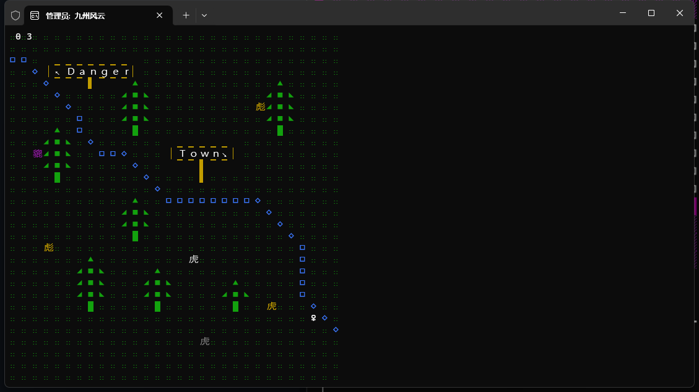
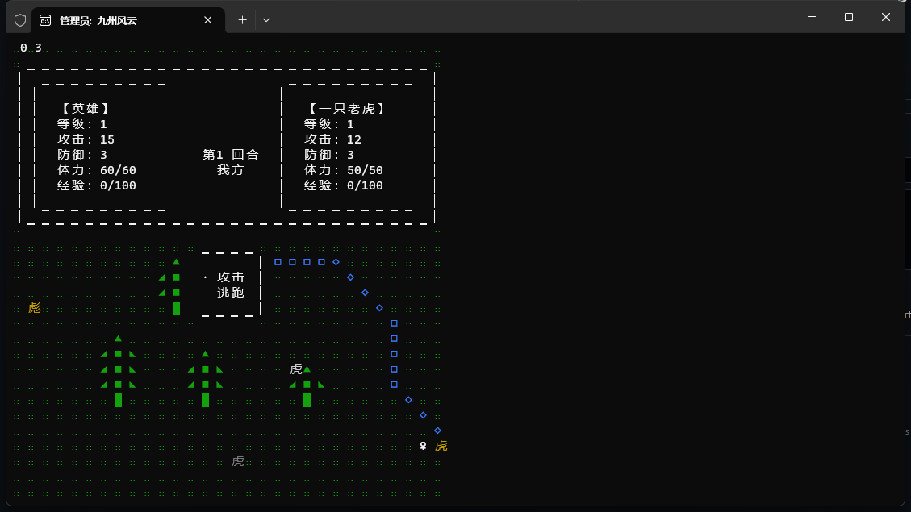

#基于 [Console-Rpg-Engine](https://github.com/xiaorang/Console-Rpg-Engine) 改造,非常感谢xiaorang的开源。


## 说明

用控制台做游戏的缺点是界面效果的表现力受限，好处是正因为表现力受限，可以把更多的注意力放在逻辑本身。

这款RPG引擎包括了

- 地图切换系统
- 行走系统
- NPC系统
- 菜单系统
- 对话系统
- 进度存取系统
- 战斗系统
- 内部变量系统
- 脚本系统
- 扩展功能：
- 1、在原有Console-Rpg-Engine引擎基础上增加通过http的GET请求获取在线实时结果保存到指定变量中的功能。【已完成】
- 2、增加对话系统中，使用变量内容做为对话内容展示的方法。【已完成】
- 3、增加在脚本中使用当前现实世界时间（精确到小时）作为逻辑判断的方法。【已完成】

对于简单的RPG游戏来说，已经比较完整的了。

代码的结构非常简单，使用dev c++开发，没有用工程，打开rpg.cpp编译运行即可。
其中包括了4个文件

- rpg.cpp 主程序，运行控制
- action.cpp 脚本处理
- tools.cpp 工具函数
- audio_clip.cpp 音乐播放库


===============================================

###网络请求数据赋值方法：

```shell
@var
URLTEXT|V9=http://172.18.165.135/go.html
```

@var 固定为变量赋值声明

URLTEXT|  开头则表示为通过网络请求获取数据内容。

V9        变量名称

http://172.18.165.135/go.html 可以是由任何方式的get请求地址。可以附带请求参数等。需要注意的是如果返回的内容中包含中文，需要确保字符编码为GBK或者GB2312。否则可能在后续的对话中无法正常显示。


==============================================

###对话中使用变量作为对话内容的方法：

```shell
@talk
测试,你来<%V9>，等级<%_Lev>级。
囧大,最近本镇很不安宁，夜里总能听到野兽咆哮的声音。
@endTalk
```

@talk 声明以下内容为对话

','号左边的部分表示对话角色名称。

','号右边的部分表示对话的内容。如果需要从游戏内存变量中获取内容。则需要用<%变量名>来表示，后面跟的V9就是游戏内存中变量的名称。


==============================================

###对话中使用当前系统时间作为逻辑判断的方法：

```shell
#C:(民,15)  探索触发对话，但可以自由行动，冒号后面的是其图形和颜色
46,6
@if
%time=21
@talk
居民,每天这个时候妖怪都会出现。
@endtalk
@else
@talk
居民,现在总算是安全了。
@endtalk
@endif
#END
```

正常情况下%号后跟的字符表示需要判断的内存中变量的值，当脚本输入为%time时，则表示判断当前时间是否为=号右边的时间值。条件满足则继续执行。

===============================================







